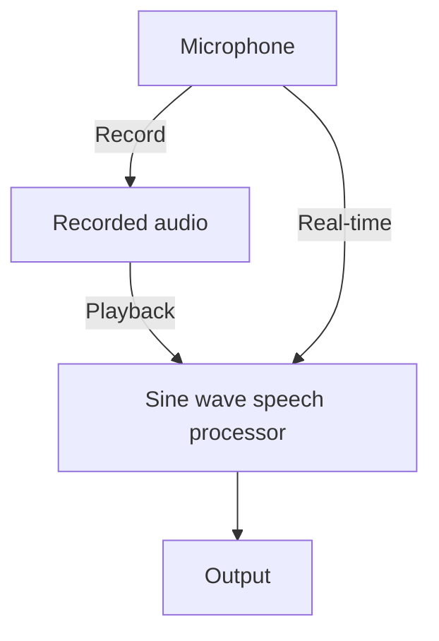
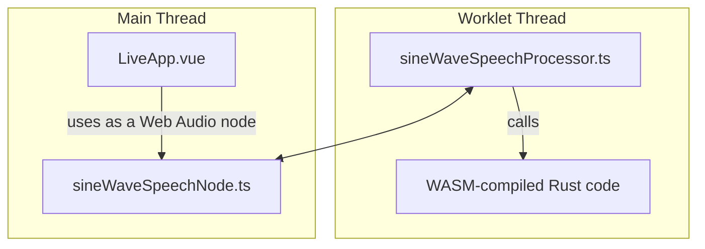

Turn any sound into music, in real time, in your browser.

[](https://sinewavespeech.com)

[sinewavespeech.com](https://sinewavespeech.com) is an interactive website for exploring how human speech can be reduced *extremely* and still be intelligible.
You can find the source code [on my GitHub](https://github.com/vvolhejn/sine_wave_speech).

About a year before this project, I made [sinewavespeech.com/explanation/](https://sinewavespeech.com/explanation/),
which demonstrates the effect on a pre-sinewaved recording.
You can read more about that in [this post]().

In this one, I'll go over the project from different angles, from least to most technical: The UX, the [high-level architecture](#going-real-time-with-rust), [strategies for translating code you don't understand](#how-to-translate-code-you-dont-understand), and finally, [my impressions of Rust for scientific computing](#rust-is-not-there-yet).

# UX design

> I can already read the criticism, that 'there's no active EQ, no pickup this, it's not versatile'. \*You're\* not versatile.

[](https://youtu.be/9eOF7t4HgjE?t=49)

That's Vulfpeck band leader Jack Stratton talking about their single-knob [Joe Dart bass guitar](https://youtu.be/9eOF7t4HgjE?t=49).
Jack is defending the choice of having only a simple volume knob rather than multiple knobs that would allow you to fine-tune the tone of the bass.

I agree with Jack: the musician having less control might seem like a bad thing, but it also means that the maker can ensure the bass sounds good no matter the settings.
This is also why I love the [Sausage Fattener](https://youtu.be/jHFzfZl6NQQ?t=63) VST.
It has two knobs. It makes the sound fat. That's it.

I tried to apply the same less-is-more philosophy to the sine wave speech effect.
I ended up with five parameters:
- Step size: how short or long the notes are.
- Number of waves: decompose into this many sine waves.
- Scale: whether the frequencies get snapped to musical notes, and how restrictive the scale is. More on that later.
- Gain: adjust the loudness.
- Depth: decrease the frequency of the lower sine waves to get a fuller sound.

Additionally, there some features under the hood to keep you from making it sound awful.
I compress the dynamic range of the resulting audio so that there aren't huge differences in loudness.
I also adjust the loudness based on the frequency of the sine wave to compensate for the fact that humans
[perceive certain frequencies to be louder](https://en.wikipedia.org/wiki/A-weighting).

Admittedly, my five knobs are a far cry from the one-knob ideal of the Joe Dart bass.
Dear reader, in my defense, I did resist the temptation of adding any of the following:
- The option to use other wave shapes, like squares or triangles
- Allowing to record for longer periods of time
- Uploading audio files
- Downloading the processed audio
- Trimming the recording to a shorter passage

If enough people complain about one of these things missing, I might still add it.
The way to keep things simple could be adding a simple/advanced mode trigger,
hiding the more complicated things under advanced mode.

## The scale slider

One particularity of the design is the "scale" slider, which lets you select how strongly the notes get quantized – a kind of autotune.
In a regular autotune-like application, you typically have two dimensions to control:
which notes you want to snap to (G minor, A major pentatonic...), and how strongly to pull the signal towards these notes.

I wanted something simpler: a single slider that goes from "out of tune" to "in tune".
This is what I came up with:



By moving the slider, you increase the strength of the quantization: notice how the input frequencies cluster get pulled to the frequencies of musical notes.

But simultaneously, this changes the set of notes we're snapping to, from chromatic through diatonic to pentatonic.
A more restrictive set of notes like the pentatonic means that they'll sound good together no matter what you play.

Put simply, the chromatic scale is any of the 12 notes you can play on a piano,
a diatonic scale means you only play the white keys,
and a pentatonic scale means only the black keys.
In our case, the pentatonic is transposed "to the white keys" so that it becomes a subset of the diatonic scale.


I like this single-slider simplification, but it does have one issue:
if you set the slider to something between diatonic and pentatonic, some frequencies will not correspond to any note.
This doesn't happen if you set it exactly to diatonic.
That means that in some cases, increasing the slider can make the output sound more dissonant,
but it's a tradeoff I'm willing to live with.

# The plan

In [the first iteration](https://sinewavespeech.com/explanation/) of the project, I implemented the effect in Python by translating [Matlab code from the 90s](https://github.com/vvolhejn/sine_wave_speech/tree/main/matlab_code_archive) that I found on the internet.
This time, I wanted everybody to be able to transform their voice without needing to write any code, straight from the browser.
Sadly, it's not easy to run Python in the browser and that meant that I had to translate the code a second time.

The plan was to use the [Web Audio API](https://developer.mozilla.org/en-US/docs/Web/API/Web_Audio_API) to get detailed control over sound in the browser,
using an [AudioWorklet](https://developer.mozilla.org/en-US/docs/Web/API/Web_Audio_API/Using_AudioWorklet) that would run the sine wave speech effect in a separate thread.
The audio effect itself would be written in Rust and [compiled into WebAssembly](https://rustwasm.github.io/book/) so that it can run in the browser.

I used this [tutorial on pitch detection via Rust+wasm](https://www.toptal.com/webassembly/webassembly-rust-tutorial-web-audio) as a starting point.

## Web Audio API

The [Web Audio API](https://developer.mozilla.org/en-US/docs/Web/API/Web_Audio_API) is a relatively recent system for controlling audio on the web.
It's powerful: you can define an arbitrary graph of audio nodes that create, process, and receive audio, just like you would in a digital audio workstation
or in something like [Max](https://en.wikipedia.org/wiki/Max_(software)).

Our graph is fairly simple. Audio flows into the sine wave speech processor either directly from the microphone,
or from an audio buffer that a user can record first and then loop.
That's particularly handy if you don't have headphones, because you'd get a feedback loop if you used real-time input.



The older [sinewavespeech.com/explanation/](https://www.sinewavespeech.com/explanation/) uses the Web Audio API more heavily:
it explicitly controls separate [`OscillatorNode`](https://developer.mozilla.org/en-US/docs/Web/API/OscillatorNode)s to generate the individual sine waves.
It would've been possible to do that in the live version too, but I thought it'd be easier to handle the whole synthesis in Rust directly
so that the logic is not scattered between Rust and TypeScript.

The sine wave speech processor can run our Rust code in a separate thread using an [`AudioWorklet`](https://developer.mozilla.org/en-US/docs/Web/API/Web_Audio_API/Using_AudioWorklet).
Worklets are wild. You tell a worklet what code to run by calling `audioWorklet.addModule()` and passing in _a URL of a JS file_.
Since this bypasses the regular import mechanism, it doesn't play nice with bundling, not to mention TypeScript.



You also need to somehow pass the wasm code to the worklet, because you can't import it from the worklet (AFAIK).
The whole thing was a headache,
but luckily Peter Suggate who wrote [the tutorial I used as a reference](https://www.toptal.com/webassembly/webassembly-rust-tutorial-web-audio)
had already figured out most of the sharp bits.

## The mysterious iPhone bug

There was just one other issue that I banged my head against for two days:
I got no sound when trying to play pre-recorded audio on my iPhone.
If I recorded a clip and then played it back, it worked fine.
It was just the default clip that plays when you directly press "Play" that didn't make any sound.
There was no error message to be found anywhere, and the visualization worked as expected.

This confounded me for the longest time, until I found the issue by complete accident when I tried to play a DJ mix from SoundCloud.
I couldn't get SoundCloud to work with my WiFi-based speaker, so I put my headphones on to listen to it.
I went back to debugging and realized the sound suddenly started working!

After that, I quickly found that the source of the issue was that I had my do-not-disturb switch on.
In do-not-disturb mode, iOS tries to prevent the phone from accidentally making loud noises.
So if you put on headphones, it's ok.
If you give the website microphone access, it's also ok because you're aware you're doing audio-related things
– that's why the sound works if you first record something and then play it back.
But if you just press the "Play" button, no sound will come out.

Of course, it was only after I fixed the bug myself that I managed to find this [StackOverflow post](https://stackoverflow.com/questions/76291413/no-sound-on-ios-only-web-audio-api)
where someone had the same issue.

# Going real-time with Rust

<!-- https://www.toptal.com/webassembly/webassembly-rust-tutorial-web-audio -->

I chose to use Rust for a few reasons.
- Efficiency: I wasn't sure how computationally expensive the effect would be, and using JavaScript would mean risking that it ends up being too slow on mobile devices.
- Libraries: JavaScript's scientific computing ecosystem is much less mature
  than Python's, so I'd have to write some functions which I'd get for free in
  Python. That's not really an argument in favor of Rust – and we'll see the
  situation isn't much better there – but it's an argument against JavaScript.
- Learning: I had never worked with Rust before this so I wanted to see what the hype is about. I also hadn't used WebAssembly.

# How to translate code you don't understand


As mentioned [the previous post](#how-does-this-work-technically),
my Sine Wave Speech code is based on a Matlab implementation from the 90s.
With some help from Copilot, I translated it into Python, the language I'm most comfortable with.

This iteration was a new challenge:
I had never used Rust before so it would be very difficult for me to know if the code is correct.
This is where unit tests come in particularly handy.
For simple functions like upsampling a signal, it's easy to figure out what the expected output is and write a corresponding test.
But it's a lot trickier to write a unit test for, let's say, a function that returns the [Linear Predictive Coding](https://en.wikipedia.org/wiki/Linear_predictive_coding) coefficients of order $$p$$ on Hann-windowed frames of audio.
Especially if, like me, you've never taken a DSP class and you only have a loose idea of what that all actually means.

Luckily, we have the Python implementation which we know works.
To unit test `fit_lpc()`, we can simply run the Python version of the function on some data
and store both the input and output in a format like JSON.
Then we check that the Rust code outputs the same thing.

I used [MessagePack](https://msgpack.org/index.html) rather than JSON to make the fixture more compact.
The fixture is mainly a bunch of floats, and for that, JSON is very wasteful because it stores numbers like "508.2762307926977" directly in their decimal representation, which in this case is 17 bytes.
MessagePack and other binary formats are a lot better because to store a [float32](https://en.wikipedia.org/wiki/Single-precision_floating-point_format) they only use 4 bytes, leading to a file that's ~4x smaller.

The test function then looks something like this:

```rust
#[test]
fn test_fit_lpc() {
    let fixture = read_msgpack_fixture("python_sws_results.msgpack");

    let audio = Array1::from_vec(fixture.audio);
    let lpc_coefficients = fit_lpc(
      &audio, fixture.n_waves * 2, fixture.hop_size
    );

    let epsilon = 1e-2; // allow for some error in the comparison
    assert_array2_eq(
      &lpc_coefficients, &fixture.expected_lpc_coefficients, epsilon
    );
}
```

Why do we need to allow for an error in the calculations if we want the Rust code to do _exactly_ the same thing as the Python code?
For several separate reasons:
- I used float32 in Rust and float64 in Python, so there's a precision mismatch.
- Some subroutines, like finding the eigenvalues of a matrix, are outsourced to the linear algebra libraries of the respective languages, and their implementations will be different.
- Floating-point arithmetic [is not associative](https://stackoverflow.com/questions/10371857/is-floating-point-addition-and-multiplication-associative),
  so computing the sum of an array can give different results depending on the order of iteration.
  If you're not familiar with the intricacies of floats, I recommend this [introduction video by Jan Misali](https://www.youtube.com/watch?v=dQhj5RGtag0).

With the Python reference implementation, unit tests, and a little help from [Claude](https://www.anthropic.com/claude), it seems that this would be a breeze. But alas:

# Rust is not there yet

As the [technology-conservative](https://boringtechnology.club/) reader might expect,
it turns out Rust is not all sunshine and rainbows.
In particular, Python's scientific computing ecosystem is much more mature than Rust's.
In Rust's defense, linear algebra routines are not the selling point of the language.
Nevertheless, I had to jump through more hoops than I expected.

When you think about it, NumPy does a lot.
At its core, there is the n-dimensional array and the convenient interface for vectorized arithmetic, broadcasting and indexing.
But there's so much on top of that: random number generators, linear algebra routines, Fourier transforms, and more.

In Rust, there is the [`ndarray`](https://docs.rs/ndarray/latest/ndarray/) crate, which provides n-dimensional arrays, but not much else.
The excitement of discovering that there is a [`ndarray::linalg` module](https://docs.rs/ndarray/0.16.1/ndarray/linalg/index.html) goes away quickly when you realize the only thing it implements is matrix multiplication.
It makes sense in theory: `ndarray` can provide the data type and others can build their scientific tools upon it, similar to how [SciPy](https://scipy.github.io/devdocs/dev/) is built on top of NumPy, but with a clearer separation of concerns.

So where are these scientific computing crates that build on top of `ndarray`? Let's have a look. I needed to replace two functions from NumPy/SciPy.

The first was [`scipy.linalg.solve_toeplitz`](https://docs.scipy.org/doc/scipy/reference/generated/scipy.linalg.solve_toeplitz.html), a function to solve a [Toeplitz system](https://en.wikipedia.org/wiki/Toeplitz_matrix). That's a matrix equation $$Ax = y$$ where $$A$$ is a special kind of matrix, which makes the equation easier to solve.
It looks something like this:

$$
\begin{bmatrix}
a & b & c & d & e \\
f & a & b & c & d \\
g & f & a & b & c \\
h & g & f & a & b \\
i & h & g & f & a 
\end{bmatrix}
\cdot
\begin{bmatrix}
x_1 \\ x_2 \\ x_3 \\ x_4 \\ x_5 \\
\end{bmatrix}
=
\begin{bmatrix}
y_1 \\ y_2 \\ y_3 \\ y_4 \\ y_5 \\
\end{bmatrix}
$$

I couldn't this in any crate.
In the end, I found SciPy's [Cython implementation](https://github.com/scipy/scipy/blob/92d2a8592782ee19a1161d0bf3fc2241ba78bb63/scipy/linalg/_solve_toeplitz.pyx)
and asked Claude to translate it into Rust, which it [had no problem doing](https://github.com/vvolhejn/sine_wave_speech/blob/472d41c16c1b6114ab6ec4ed08032986913f4df2/wasm_realtime_sws/src/linear_algebra.rs#L45).

The other thing I needed was simple: finding the complex roots of a polynomial.
Compared to the niche Toeplitz system, I was sure this'd be a walk in the park.
It was not.

In Python, you'd call `np.roots()`.
If we look [under the hood](https://github.com/numpy/numpy/blob/v2.1.0/numpy/lib/_polynomial_impl.py#L163-L253), we see that it finds the roots by computing the eigenvalues of a special matrix derived from the polynomial.
This [_companion matrix_](https://en.wikipedia.org/wiki/Companion_matrix) has the property that its eigenvalues are exactly the roots of the polynomial.
For a polynomial $$c_0 + c_1x + \cdots + c_{n-1}x^{n-1} + x^n$$, it's defined as

$$
C(p)=\begin{bmatrix}
0 & 0 & \dots & 0 & -c_0 \\
1 & 0 & \dots & 0 & -c_1 \\
0 & 1 & \dots & 0 & -c_2 \\
\vdots & \vdots & \ddots & \vdots & \vdots \\
0 & 0 & \dots & 1 & -c_{n-1}
\end{bmatrix}.
$$

So I needed either a root-finding algorithm, or an algorithm for computing eigenvalues; either would do the job.
First, I found [something](https://rust-ndarray.github.io/ndarray-linalg/ndarray_linalg/eig/trait.Eig.html) in the `ndarray_linalg` crate.
Unfortunately, I couldn't make it find _complex_ eigenvalues, and the documentation didn't help.
By the way, be sure not to confuse [`ndarray_linalg`](https://rust-ndarray.github.io/ndarray-linalg/ndarray_linalg/index.html) with [`ndarray::linalg`](https://docs.rs/ndarray/latest/ndarray/linalg/index.html), mentioned earlier.
There are a [few](https://docs.rs/nalgebra-lapack/latest/nalgebra_lapack/struct.Eigen.html)
[alternatives](https://docs.rs/eigenvalues/latest/eigenvalues/) that I also tried and discarded for one reason or another.



After more searching than you'd think, I found the mature-ish [`nalgebra`](https://docs.rs/nalgebra/latest/nalgebra/) crate.
Amazing! It has a [`.complex_eigenvalues()`](https://docs.rs/nalgebra/latest/nalgebra/base/struct.Matrix.html#method.complex_eigenvalues) method that does exactly what I need,
and a lot more linear algebra goodies too.

Not so fast though: you can't call this method on your `Array2D` because `nalgebra` does _not_ use `ndarray` under the hood.
Instead, it has its own, separate type.
The Rust community has been discussing uniting these [since 2017](https://github.com/anowell/are-we-learning-yet/issues/14) but the discussions seem to have stalled (as of 2024).
If you want to convert between the two types, you'll need yet another crate, [`nshare`](https://docs.rs/nshare/latest/nshare/), whose only purpose is to define methods that convert between `nalgebra` and `ndarray` types. In the end, we get:

```rust
pub fn find_roots(coefs: ArrayView1<f32>) -> Array1<Complex<f32>> {
    let companion_matrix = get_companion_matrix(coefs);  // easy to implement
    let eigenvalues = companion_matrix.into_nalgebra().complex_eigenvalues();
    eigenvalues.into_ndarray1()
}
```

It's not pretty, but it does the job.
The Rust community maintains a site called [Are we learning yet](https://www.arewelearningyet.com/)
where they track the state of Rust's machine learning/scientific computing ecosystem.
Currently, it says "It's ripe for experimentation, but the ecosystem isn't very complete yet".

I agree.
