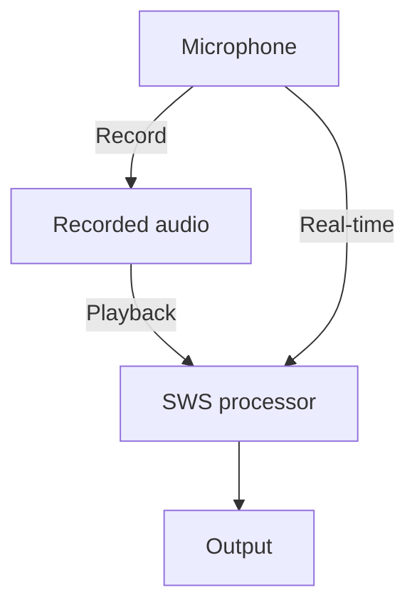

Turn any sound into music, in real time, in your browser.

[](https://sinewavespeech.com)

[sinewavespeech.com](https://sinewavespeech.com) is an interactive website for exploring how human speech can be reduced *extremely* and still be intelligible.
You can find the source code [on my GitHub](https://github.com/vvolhejn/sine_wave_speech).

About a year before this project, I made [sinewavespeech.com/explanation/](https://sinewavespeech.com/explanation/),
which demonstrates the effect on a pre-sinewaved recording.
You can read more about that in [this post]().

# UX design

> I can already read the criticism, that 'there's no active EQ, no pickup this, it's not versatile'. \*You're\* not versatile.

That's Vulfpeck band leader Jack Stratton talking about their single-knob [Joe Dart bass guitar](https://youtu.be/9eOF7t4HgjE?t=49).
The musician having less control might seem like a bad thing, but it also means that the maker can ensure the bass sounds good no matter the settings.
This is also why I love the [Sausage Fattener](https://youtu.be/jHFzfZl6NQQ?t=63) VST.
It has two knobs. It makes the sound fat. That's it.

I tried to apply the same less-is-more philosophy to the sine wave speech effect.
I ended up with five parameters:
- Step size: how short or long the notes are.
- Number of waves: decompose into this many sine waves.
- Scale: whether the frequencies get snapped to musical notes, and how restrictive the scale is. More about that later.
- Gain: adjust the loudness.
- Depth: decrease the frequency of the lower sine waves to cover more of the frequency spectrum.

Additionally, there some features under the hood to prevent you from making something truly awful-sounding.
I compress the dynamic range of the resulting audio is compressed so that there aren't huge differences in loudness.
I also adjust the loudness based on the frequency of the sine wave to compensate for the fact that humans
[perceive certain frequencies to be louder](https://en.wikipedia.org/wiki/A-weighting).

Admittedly, my five knobs are a far cry from the one-knob ideal of the Joe Dart bass.
Dear reader, in my defense, I did resist the temptation of adding any of the following:
- Using other waves than just sines, like square or triangle waves
- Allowing to record for longer periods of time
- Uploading audio files
- Download the processed audio
- Trimming the recording to a smaller passage

If enough people complain about one of these things missing, I might still add it.
Maybe the way to keep things simple would be adding a simple/advanced mode trigger,
and hide the more complicated things under advanced mode.

# Code

In [the first iteration](https://sinewavespeech.com/explanation/) of the project, I implemented the effect in Python by translating [Matlab code from the 90s](https://github.com/vvolhejn/sine_wave_speech/tree/main/matlab_code_archive) that I found on the internet.
This time, I wanted everybody to be able to transform their voice without needing to write any code, straight from the browser.
Sadly, it's not easy to run Python in the browser and that meant that I had to translate the code once again.

The plan was: Use the [Web Audio API](https://developer.mozilla.org/en-US/docs/Web/API/Web_Audio_API) to get detailed control over sound in the browser,
using an [AudioWorklet](https://developer.mozilla.org/en-US/docs/Web/API/Web_Audio_API/Using_AudioWorklet) that would run the sine wave speech effect in a separate thread.
The audio effect itself would be written in Rust and [compiled into WebAssembly](https://rustwasm.github.io/book/) so that it can run in the browser.

I used this [tutorial on pitch detection via Rust+wasm](https://www.toptal.com/webassembly/webassembly-rust-tutorial-web-audio) as a starting point.

# Web Audio API

The [Web Audio API](https://developer.mozilla.org/en-US/docs/Web/API/Web_Audio_API) is a relatively recent system for controlling audio on the web.
You can define a complex graph of audio nodes that create, process, and receive audio, just like you would in a digital audio workstation
or in something like [Max](https://en.wikipedia.org/wiki/Max_(software)).

Our graph is fairly simple. Audio flows into the Sine Wave Speech (SWS) processor either directly from the microphone,
or from an audio buffer that a user can record first and then loop.
That's particularly handy if you don't have headphones, because you'd get a feedback loop if you used real-time input.



The older [sinewavespeech.com/explanation/](https://www.sinewavespeech.com/explanation/) uses the Web Audio API more heavily:
it explicitly controls separate [`OscillatorNode`](https://developer.mozilla.org/en-US/docs/Web/API/OscillatorNode)s to generate the individual sine waves.
For the live version I thought it'd be easier to handle the whole synthesis in Rust directly.

The SWS processor can run our Rust code in a separate thread using an [`AudioWorklet`](https://developer.mozilla.org/en-US/docs/Web/API/Web_Audio_API/Using_AudioWorklet).
Worklets are wild. You tell a worklet what code to run by calling `audioWorklet.addModule()` and passing in _a URL of a JS file_.
Of course, this doesn't play nice with bundling, not to mention TypeScript.
You also need to somehow pass the wasm code to the worklet, because you can't import it from the worklet (AFAIK).
The whole thing was a headache,
but luckily Peter Suggate who wrote [the tutorial I used as a reference](https://www.toptal.com/webassembly/webassembly-rust-tutorial-web-audio)
had already figured out most of the sharp bits.

# Going real-time with Rust

<!-- https://www.toptal.com/webassembly/webassembly-rust-tutorial-web-audio -->

I chose to use Rust for a few reasons.
- Efficiency: I wasn't sure how computationally expensive the effect would be, and using JavaScript would mean risking that it ends up being too slow on phones etc.
- Libraries: JavaScript's scientific computing ecosystem is much less mature
  than Python's, so I'd have to write some functions which I'd get for free in
  Python. That's not really an argument in favor of Rust – and we'll see the
  situation isn't much better there – but it's an argument against JavaScript.
- Learning: I had never worked with Rust before this so I wanted to see what the hype is about. I also hadn't used WebAssembly.

# I don't know what it does, but I can check that it does it correctly

As mentioned [the previous post](#how-does-this-work-technically),
my Sine Wave Speech code is based on a Matlab implementation from the 90s.
With some help from Copilot, I translated it into Python, the language I'm most comfortable with.

This iteration was a new challenge:
I had never used Rust before so it would be very difficult for me to know if the code is correct.
This is where unit tests come in particularly handy.
For simple functions like upsampling a signal, it's easy to write unit tests and figure out what the expected output is.
But it's a lot trickier to write a unit test for, let's say, a function that returns the [Linear Predictive Coding](https://en.wikipedia.org/wiki/Linear_predictive_coding) coefficients of order _p_ on Hann-windowed frames of audio.
Especially if, like me, you've never taken a DSP class and you only have a loose idea of what that all actually means.

Luckily, we have the Python implementation which we know works.
To unit test `fit_lpc()`, we can simply run the Python version of the function on some data
and store both the input and output in a format like JSON.

I used [MessagePack](https://msgpack.org/index.html) rather than JSON to make the fixture more compact.
The fixture is mainly a bunch of floats, and for that, JSON is very wasteful because it stores numbers like "508.2762307926977" directly in their decimal representation, which in this case is 17 bytes.
MessagePack and other binary formats are a lot better because to store a [float32](https://en.wikipedia.org/wiki/Single-precision_floating-point_format) they only use 4 bytes, leading to a file that's ~4x smaller.

The test function then looks something like this:

```rust
#[test]
fn test_fit_lpc() {
    let fixture = read_msgpack_fixture("python_sws_results.msgpack");

    let audio = Array1::from_vec(fixture.audio);
    let lpc_coefficients = fit_lpc(
      &audio, fixture.n_waves * 2, fixture.hop_size
    );

    let epsilon = 1e-2; // allow for some error in the comparison
    assert_array2_eq(
      &lpc_coefficients, &fixture.expected_lpc_coefficients, epsilon
    );
}
```

Why do we need to allow for an error in the calculations if we want the Rust code to do _exactly_ the same thing as the Python code?
First, I used float32 in Rust and float64 in Python, so there's a precision mismatch.
But we'd need the `epsilon` even if both versions used float64.
Some subroutines, like finding the eigenvalues of a matrix, are outsourced to the linear algebra libraries of the respective languages, and their implementations will be different.

Even if they were mathematically the same, floating-point arithmetic [is not associative](https://stackoverflow.com/questions/10371857/is-floating-point-addition-and-multiplication-associative),
so computing the sum of an array can give different results depending on the order of iteration.
If you're not familiar with the intricacies of floats, I recommend this [introduction video by Jan Misali](https://www.youtube.com/watch?v=dQhj5RGtag0).

_More coming soon._

<!-- ## The Amerustacean Dream

Remember how I said that JavaScript is way behind Python when it comes to scientific computing?
As it turns out, so is Rust (a language that is 20 years younger). Who knew!
 -->

<!-- the iphone silence issue -->