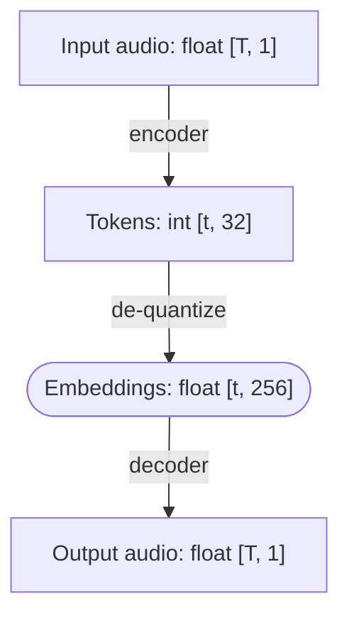

I ran a week-long seminar on creative coding at a retreat
organized by the [European Academic Foundation](https://europeanacademicfoundation.eu/).

Thirteen students aged 17–21 joined and created a bunch of fun things:

## Weird pizza

_Beloslava Malakova, Boris Gachevski, Dion Aliu, Nea Metohu_

[GitHub repo](https://github.com/beloslavamalakova/eaf-segment)

Neu

## Gesture control for music

_Benedikt Meier, Elias Koschier_

[GitHub repo](https://github.com/B3neM31/LiDAR-Music-Control)

The initial idea was to allow the user to control the volume 

## QR Dodecahedron

_Alexandru Turculet, Tudor Dochia_

https://eaf-cret-cod.vercel.app/

## Bots for Liar's Dice

_David Lang, Janko Bušelić, Matas Povilaitis_

[GitHub repo](https://github.com/davidvoncos-bit/Liar-s-dice)

The group developed several strategies for playing [Liar's Dice](https://dudo.ai/),
a bluffing game.
They pitted them against each other to see which bot does the best.
The most successful strategy was [`ProbabilityBot`](https://github.com/davidvoncos-bit/Liar-s-dice/blob/22839429643c8ba803ecc63cfd9babd8464daadb/bots.py#L163C7-L163C21),
which calculates the probability of the opponent's claimed "hand" and compares it to that of its possible next moves.
Still, Liar's dice is not a simple game and there are counter-strategies to `ProbabilityBot`, such as [`TrustingBot`](https://github.com/davidvoncos-bit/Liar-s-dice/blob/22839429643c8ba803ecc63cfd9babd8464daadb/bots.py#L227).

The original idea was to create a bot for poker, but given the limited amount of time, we opted for something smaller.
I didn't know Liar's dice before, but I think it was a good choice: it's one of the simplest imperfect-information games,
but still complex enough to be interesting.

## Experiments with neural audio codecs

_Matěj Pokorný, Yevhenii Hohin_

The group experimented with manipulating audio using neural audio codecs.
Understanding this project requires a bit of background about these codecs:

Neural audio codecs, pioneered by [SoundStream](https://arxiv.org/abs/2107.03312),
are now the de-facto standard way to process audio in language models.
For this project, we used [Mimi](https://huggingface.co/kyutai/mimi),
a codec developed by [Kyutai](https://kyutai.org/), the lab where I work (though Mimi predates me).

Mimi converts 24 kHz audio into a sequence of tokens sampled at 12.5 Hz.
For each frame, there are 32 tokens representing increasingly fine-grained information about the sound.
To decode the tokens back into a waveform, we first need to de-quantize into a sequence of
256-dimensional vectors of floats, still at 12.5 Hz.
Afterwards, a decoder model transforms these embeddings into a waveform.

The idea of the project was to explore what kind of audio manipulations become easy in embedding space.
For example, an audio represented as a waveform ([time domain](https://en.wikipedia.org/wiki/Time_domain))
is easy to make quieter or louder by multiplying everything by a constant.
With a spectrogram ([frequency domain](https://en.wikipedia.org/wiki/Frequency_domain)), we can easily
boost or suppress specific frequencies.
What can we do with embeddings of neural audio tokens?
