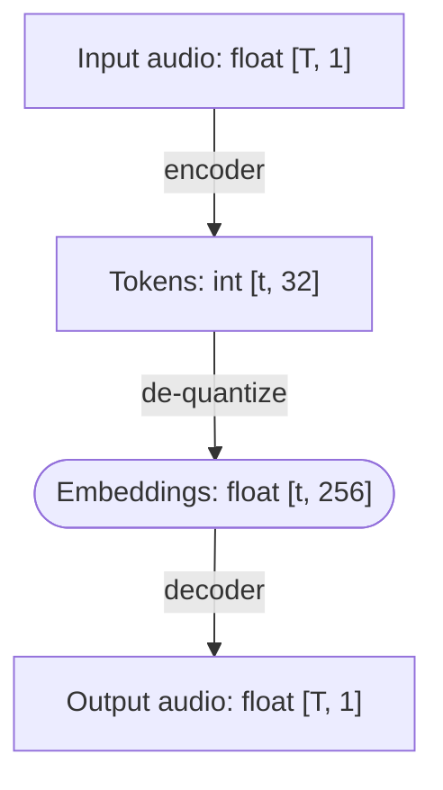

I ran a week-long seminar on creative coding at a retreat
organized by the [European Academic Foundation](https://europeanacademicfoundation.eu/).
The seminar ran for five days (8–12 September) for 3-hour sessions.

Thirteen students aged 17–21 joined and created a bunch of fun things:

## Weird pizza with Segment Anything

_Beloslava Malakova, Boris Gachevski, Dion Aliu, Nea Metohu_
 
[Site](https://segment-craft-eaf.lovable.app/), [GitHub repo](https://github.com/beloslavamalakova/eaf-segment)

Semantic replacement of image parts using the [Segment Anything](https://segment-anything.com/) model.
The main test case was this photo of a pizza.
Segment Anything identifies the exact boundaries of objects – in this case, we take the pepperonis –
and then they are replaced by unrelated images, like balls.
Check out the other examples at [the demo site](https://segment-craft-eaf.lovable.app/) Boris made.



The broader idea was to make "automatic collages" by taking images, breaking them up into parts using SAM
and then replacing them with similar-shaped/similar-looking images from the [Segment Anything dataset](https://segment-anything.com/dataset/index.html).
I attempted something like this two years ago but found it tricky to create a good shape-based search.
The group's solution was to sidestep the problem of finding exactly matching shapes by stretching the replacement images.
Good idea!

The stretching algorithm, designed by Dion, is interesting in its own right.
It takes the texture from one image and fits it into the shape of another.
It works by converting each shape into normalized polar coordinates,
where the distance is normalized to [0, 1] based on where the furthest point is in that specific angle.
This won't work for shapes where you can't "see everything" from the center, such as U-shaped objects,
but it produces fascinating results when it does work:



Combined with the pepperoni replacement algorithms, we get Dalí-esque surrealist melted footballs on top of a pizza.
Yum.

## QR Dodecahedron

_Alexandru Turculet, Tudor Dochia_
 
[Site](https://eaf-cret-cod.vercel.app/), [GitHub](https://github.com/Al-Tex/EAF-cretCod)



Find the correct QR code by turning a dodecahedron fully covered in them.
Most of them are decoys, though!
You'll know when you find the correct one because the remaining codes all say the same thing,
namely... well, just scan this image.

There are 11 codes in total, and some of them are also damaged or are just random noise.
The project uses Three.js, and the projecting of the QR codes onto the dodecahedron is done using shaders.

Alex and Tudor didn't have their laptops with them, they only brought Android tablets with external keyboards.
Even setting up a programming environment was a challenge, and in the end they settled on a web-based approach
because getting something like Python working wasn't easy.

Of course, that's also a good choice because then the result is easy to share. Be sure to [check it out](https://eaf-cret-cod.vercel.app/).

## Gesture control for music

_Benedikt Meier, Elias Koschier_
 
[GitHub repo](https://github.com/B3neM31/LiDAR-Music-Control)

Gesture control for music.
Pinch to play/pause, swipe to switch tracks, and most importantly: clap to rick-roll.

  <video controls width="80%">
    <source src="/assets/2025-09-12-creative-coding-seminar/gesture-control.mp4" type="video/mp4" />
  </video>

Technically, this uses the iPhone's lidar sensor combined with ARKit.
The core of the project is custom gesture detection built on top of the [hand tracking provided by ARKit](https://developer.apple.com/documentation/visionOS/tracking-and-visualizing-hand-movement).
Originally, Elias and Benedikt wanted to control the music volume based on how far the hand is,
but iPhone apps aren't allowed to change the volume (for good reason).

Benedikt is a law student and has never coded, and Elias has never developed an iOS app either, so I'm impressed at how well they handled the project.
Naturally, the app is largely vibe coded, which I think makes total sense.
They picked a well-scoped project, knew what the outcome should be, and managed to use available tools to get there.

## Bots for Liar's Dice

_David Lang, Janko Bušelić, Matas Povilaitis_
 
[GitHub repo](https://github.com/davidvoncos-bit/Liar-s-dice)

The group developed several strategies for playing [Liar's Dice](https://dudo.ai/),
a bluffing game.
You and your opponent each secretly roll five dice and then you take turns claiming
that you have a stronger combination than your opponent.
For instance, if you say "I have two fours", your opponent can claim two fives, two sixes, three ones, three twos...
Eventually, one player decides to _challenge_, at which point the dice are revealed.
The player who challenged wins if their opponent was lying.

The group pitted the bots against each other to see which one does the best.
The most successful strategy was [`ProbabilityBot`](https://github.com/davidvoncos-bit/Liar-s-dice/blob/22839429643c8ba803ecc63cfd9babd8464daadb/bots.py#L163C7-L163C21),
which calculates the probability of the opponent's claimed "hand" and compares it to that of its possible next moves.
Still, Liar's dice is not a simple game and there are counter-strategies to `ProbabilityBot`, such as [`TrustingBot`](https://github.com/davidvoncos-bit/Liar-s-dice/blob/22839429643c8ba803ecc63cfd9babd8464daadb/bots.py#L227)
(although here they tie).



The original idea was to create a bot for poker, but given the limited amount of time, the group opted for something smaller.
I didn't know Liar's dice before, but I think it was a good choice: it's one of the simplest imperfect-information games,
but still complex enough to be interesting.

## Experiments with neural audio codecs

_Matěj Pokorný, Yevhenii Hohin_
 
[GitHub repo](https://github.com/yevhenliu/eaf-seminar)

The group experimented with manipulating audio using neural audio codecs.
Understanding this project requires a bit of background about these codecs:

Neural audio codecs, pioneered by [SoundStream](https://arxiv.org/abs/2107.03312),
are now the de-facto standard way to process audio in language models.
For this project, we used [Mimi](https://huggingface.co/kyutai/mimi),
a codec developed by [Kyutai](https://kyutai.org/), the lab where I work (though Mimi predates me).

Mimi converts 24 kHz audio into a sequence of tokens sampled at 12.5 Hz.
For each frame, there are 32 tokens representing increasingly fine-grained information about the sound.
To decode the tokens back into a waveform, we first need to de-quantize into a sequence of
256-dimensional vectors of floats, still at 12.5 Hz.
Afterwards, a decoder model transforms these embeddings into a waveform.

The idea of the project was to explore what kind of audio manipulations become easy in embedding space.
For example, an audio represented as a waveform ([time domain](https://en.wikipedia.org/wiki/Time_domain))
is easy to make quieter or louder by multiplying everything by a constant.
With a spectrogram ([frequency domain](https://en.wikipedia.org/wiki/Frequency_domain)), we can easily
boost or suppress specific frequencies.
What can we do with embeddings of neural audio tokens?

Matěj and Yevhenii implemented stretching, scaling, rotation, and a few other changes.
My favorite is rotation, where the dimensions of the embeddings are paired and then rotated,
kind of like in [RoPE](https://arxiv.org/abs/2104.09864).
Here's how it sounds for 45 degree rotation:

<audio controls src="/assets/2025-09-12-creative-coding-seminar/rotation_45deg.wav"></audio>

and 150 degrees (warning, loud):

<audio controls src="/assets/2025-09-12-creative-coding-seminar/rotation_-150deg.wav"></audio>

Very noisy and distorted, but in unique ways that would be difficult to reproduce otherwise. Love it.